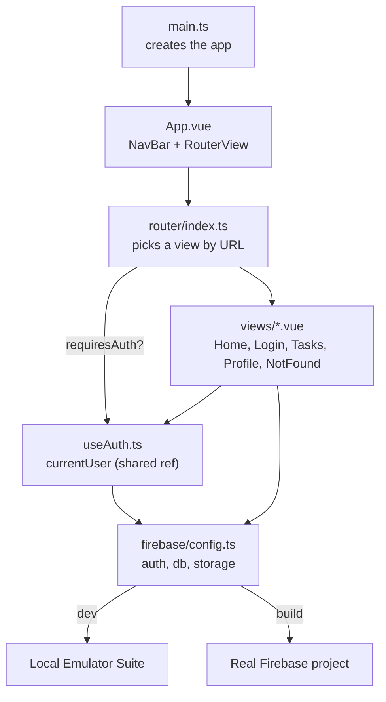

# Frontend architecture

This explains how the pieces in `src/` fit together at runtime — what loads first, how
pages get their data, and where shared state lives. It's a companion to the "Project
structure" section in the [README](../README.md), which just lists the files; this walks
through how they call each other.

If you've written Java before: think of this app as one long-running program (the
browser tab). `main.ts` is `public static void main`. Vue components are like classes
with instance state (`ref`s) and a `render()` method (the `<template>`). There's no
framework-managed database connection pool — instead there's one shared Firebase "client
object" (`src/firebase/config.ts`) that every part of the app imports and reuses.

## The big picture



Everything funnels through **one Firebase client** (`auth`, `db`, `storage`, exported
from `src/firebase/config.ts`) and **one auth state** (`currentUser`, exported from
`src/composables/useAuth.ts`). No component talks to Firebase's SDK directly without
going through those two files.

## Startup sequence

1. **`src/main.ts`** creates the Vue app, installs the router, and mounts it to
   `#app` in `index.html`. This runs once, when the page first loads.
2. **`src/App.vue`** is the root component. It's just a `NavBar` plus a `RouterView` —
   the router swaps whatever goes inside `RouterView` as the URL changes. Nothing else
   is global chrome; every page owns its own layout below the nav bar.
3. **`src/router/index.ts`** maps URLs to view components (see below) and lazy-loads
   each one (`() => import('@/views/...')`) so the browser only downloads code for the
   page you're actually on.

## Routing and auth guards

Each route in `router/index.ts` can carry `meta: { requiresAuth: true }` or
`meta: { requiresGuest: true }`. A single `router.beforeEach` hook checks that flag
against `currentUser` from `useAuth()` before every navigation:

- `requiresAuth` (Tasks, Profile) → bounces signed-out visitors to `/login`, remembering
  where they were headed via `?redirect=`.
- `requiresGuest` (Login) → bounces already-signed-in visitors straight to `/tasks`, so
  you can't land on the login page while logged in.

Adding a new protected page is one line in the `routes` array — you don't write auth
checks inside the component itself. The guard `await`s an `authReady` promise first
(see next section), so it never redirects based on a still-loading auth state.

## Shared state without a library: `useAuth`

There's no Pinia/Vuex here (see [AGENTS.md](../AGENTS.md#conventions)). Instead,
`src/composables/useAuth.ts` declares `currentUser` as a `ref` **at module scope** —
outside the `useAuth()` function. In JS/TS, a module only ever runs once and every
`import` gets the same instance, so every component that calls `useAuth()` reads and
writes that one shared `ref` instead of getting its own copy. That's the entire
mechanism — no provider, no plugin registration.

`useAuth.ts` also exports:

- `authReady` — a promise that resolves once Firebase's first
  `onAuthStateChanged` callback fires (i.e., once it knows whether a previous session is
  still logged in). The router awaits this before checking `requiresAuth`.
- `loginWithGoogle()` / `logout()` — thin wrappers around `signInWithPopup` /
  `signOut`. Google sign-in is the only auth method in this starter; there's no
  email/password form or signup page (see AGENTS.md).

Any component can get live access to the logged-in user with:

```ts
const { currentUser, loginWithGoogle, logout } = useAuth()
```

`currentUser.value` is `null` when signed out, or a Firebase `User` object when signed
in — see how `NavBar.vue` and `HomeView.vue` branch on it with `v-if="currentUser"`.

## The Firebase connection layer

`src/firebase/config.ts` is the only file that calls `initializeApp`. It reads its
config from `VITE_FIREBASE_*` env vars and exports three ready-to-use handles:
`auth`, `db`, `storage`. Everything else imports from here — never re-initializes
Firebase itself.

The dev/prod split lives entirely in this one file: `import.meta.env.DEV` is true only
under `npm run dev`, so that's the only time `connectAuthEmulator` /
`connectFirestoreEmulator` / `connectStorageEmulator` run, pointing `auth`/`db`/`storage`
at `localhost` instead of the real project. See "Local development model" in
[AGENTS.md](../AGENTS.md) for why this must stay unconditional.

## Views: one component per page, feature-complete

`src/views/` holds one `.vue` file per route. Each view is self-contained — its own
`<script setup>`, `<template>`, and scoped `<style>` — and talks to Firebase directly
rather than through a shared data-fetching layer, since the app is small enough that
extra indirection wouldn't pay for itself yet.

- **`HomeView.vue`** — static content, reads `currentUser` to change its message.
- **`LoginView.vue`** — one button calling `loginWithGoogle()`, then redirects to
  `?redirect=` or `/tasks`.
- **`TasksView.vue`** — the Firestore real-time CRUD example (see below).
- **`ProfileView.vue`** — the Storage upload example (see below).
- **`NotFoundView.vue`** — catch-all 404 for unmatched routes.

`src/components/` is for pieces reused *across* views — right now just `NavBar.vue`,
which reads `currentUser` to decide which links to show.

## Data flow example: Tasks (Firestore, real-time)

`TasksView.vue` shows the pattern to copy for any "list of my things" feature:

1. Build a `query()` scoped to the signed-in user: `where('uid', '==', uid)` — this
   works together with `firestore.rules` (each user can only read/write their own docs)
   to keep data private per-user.
2. Subscribe with `onSnapshot(tasksQuery, ...)` instead of a one-time `getDocs()`. The
   callback re-fires automatically whenever matching documents change — locally, from
   another tab, or (once deployed) from another device — so the list stays live with no
   manual refresh or polling.
3. Call `onUnmounted(unsubscribe)` so the subscription is torn down when you navigate
   away, instead of leaking a listener that keeps firing in the background.
4. Writes (`addDoc`, `updateDoc`, `deleteDoc`) don't need to update local state
   themselves — the `onSnapshot` listener already watching that data will receive the
   change and re-render automatically.

## Data flow example: Profile (Storage + Firestore together)

`ProfileView.vue` shows the pattern for file uploads:

1. Upload the file to Storage at a per-user path (`avatars/<uid>/<filename>`) —
   `storage.rules` checks that path against the caller's `uid`, so one user can't
   overwrite another's files.
2. Get a public `downloadURL` back from Storage.
3. Save that URL into a Firestore document (`profiles/<uid>`) with `setDoc(..., {
merge: true })`, so the next visit can look the URL up again with a one-time `getDoc`
   instead of re-uploading. This is a one-time fetch (`onMounted`), not a live
   subscription — a profile photo doesn't need to update itself while you're staring at
   the same page.

## Styling

Plain scoped CSS per component — no Tailwind, no component library (see AGENTS.md).
Shared design tokens (colors, spacing basics) live in `src/assets/main.css` as CSS
custom properties (`--color-border`, `--color-error`, etc.); components reference those
variables instead of hardcoding colors, which is what makes `.error { color:
var(--color-error); }` show up throughout the views.

## Adding a new feature page

Following the existing patterns:

1. Add a `.vue` file under `src/views/`.
2. Add a route for it in `src/router/index.ts`, with `meta: { requiresAuth: true }` if
   it should be gated behind login.
3. If it needs shared data, add a TypeScript type under `src/types/` describing the
   Firestore document shape (see `types/Task.ts`).
4. Talk to Firebase directly from the view (`import { db } from '@/firebase/config'`),
   following the `onSnapshot` pattern for live lists or a one-time `getDoc`/`getDocs`
   for data that doesn't need to update live.
5. Update `firestore.rules` (and `storage.rules` if it uploads files) so the new
   collection/path is actually readable/writable by the right users — rules default to
   deny-all.
